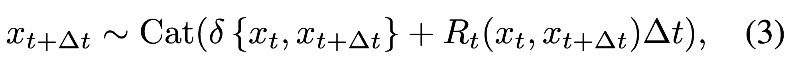
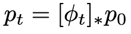
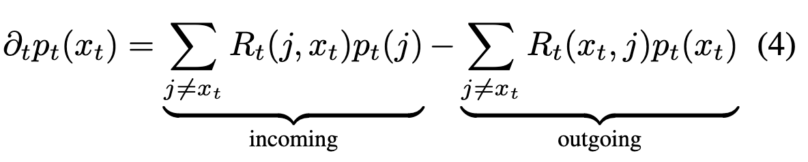

***(from)* [Generative Flows on Discrete State-Spaces: Enabling Multimodal Flows with Applications to Protein Co-Design](https://arxiv.org/abs/2402.04997)**
Andrew Campbell, Jason Yim, Regina Barzilay, Tom Rainforth, Tommi Jaakkola
ICML 2024

# CTMC definition

$S$ states and $D$ dimensions, though each dimension may have different states in general.

Over continuous time, $t \in [0, 1]$. Instead of a transition matrix $Q$ (as in [Discrete diffusion models](dne.md)), rate matrix $R_t \in \mathbb{R}^{SxS}$ w/ non-negative off-diagonal elements (b/c probabilities). $R_t(x_{t}, j) \; dt$ is the probability that $x_t$ will jump to a different state $j$ during the next time step $dt$; diagonal is negative sum of other row elements s.t. $p(x_t, x_t)$ (stay) is $1+R_t(x_t, x_t)\;dt$; and probability of transitioning anywhere from $x_t$ is thus in sum 1, while the rows sum to 0.
The rate matrix is easily converted into a transition probability matrix[^1], and generally, the probability of transition to a different state is exactly that $(i,j)$ entry, and the probability of staying in the same state is just $1+R(i,i)$. Note that always, $R$ is multiplied by $dt$[^2] when converting to probabilities.

We could infinitesimally simulate the sequence trajectory but generally we must use finite intervals $\Delta t$ and this leads us to the **Euler step**:

A CTMC is defined wholly by a rate matrix $R_t$ (note that this will be a function of time, and a parameterized NN) and an initial distribution $p_0$.

# Kolmogorov equation

A probability flow $p_t$ is defined as the marginal[^3] distribution of $x_t$; we'd like to obtain its dynamics (specifically its derivative wrt $t$) from the rate matrix somehow.
**Why?** From [Flow Matching](dne.md), a flow $\phi$ is exactly a map from $p_s$ to $p_t$ where $s < t$ (in this case $s=0$).

[^4]What this means in words is that a flow is the time derivative of the time-conditional probability path $p_t(x)$. So analogously to flow matching, we want to compute/learn $\phi$ which in this framing is just $\partial_t \; p_t(x_t)$. The **Kolmogorov equation** relates the flow to the rate matrix. The rate matrix is what’s actually parameterized, and is analogous to the vector field $u_t(x)$ in continuous-space flows.

Intuitively, the Kolmogorov equation specifies that the marginal probability of being at $x_t$ @ time $t$ changes according to the sum of the probabilities of transitioning in from other states (rate multiplied by probability of being in other state), minus the sum of probabilities of transitioning to any other state[^5]. It makes sense to write the flow this way because we’re working in a discrete space with a finite-dimensional PMF, so it’s actually super easy to quantify changes in probability[^6].
We can also write this as a matmul: $\partial_tp_t = R_t^T \cdot p_t$ where $p_t$ is a (finite) probability mass vector.
Somewhat confusingly, they refer to the series of distributions $\{p_t, t\in[0,1]\}$ as the “probability flow”, whereas [Flow Matching](dne.md) refers to $\phi$ or $\partial_tp_t$ as the “flow”. In some sense though these are equivalent; the flow tells us how to move between time-conditioned probabilities $p_t$ and so from the flow we can get the probability flow, and likewise, we can back out the flow from the full probability flow by simply looking at finite differences (or something of the sort).

# Relevance
See [Discrete Flow Models](dne.md).

# Footnotes

[^1]: In fact, after reading this, I'm not totally sure how it's different from a transition matrix, except that the diagonal entries are negative s.t. each row and column adds up to 0, as opposed to 1. This means that $Q = ?? R$. I think the formula is actually just Eqn. 1 in the paper; adding 1 to all of the diagonal elements.
[^2]: What is $dt$? Is this chosen, is it fixed or adaptive, …
[^3]: Marginalized over all of the $x_{t-1}$, and before them, all the way back to $x_0$.
[^4]: Both in that they are the parameterized object which yields the probability flow through some relation / transformation, and in that they specify how to move from some $x_s$ to some other $x_t$ in $x$ space (instead of probability space).
[^5]: If you look up the [Kolmogorov equations](https://en.m.wikipedia.org/wiki/Kolmogorov_equations), they’re generally defined as separate forward and backward equations, which are combined into one here because we want to know both incoming and outgoing; note that we can write the sums over all states and the diagonal entries (staying in same state) will cancel out (b/c same entries into rate matrix and same probabilities of being in state are in both the positive and negative terms). These equations can be defined for both “jump processes” (here) — effectively, discrete state spaces — and “diffusion processes” — continuous state spaces where some change is made at every time step, be it (usually) small.
[^6]: In the case of continuous distributions, it’s less clear how one would subtract conditional PDFs. In fact, you can’t really do this. You’d have to think of it as marginalizing over infinite states, i.e., the integral, which is often intractable or at least much more difficult to compute than a simple sum over a finite number of states.
