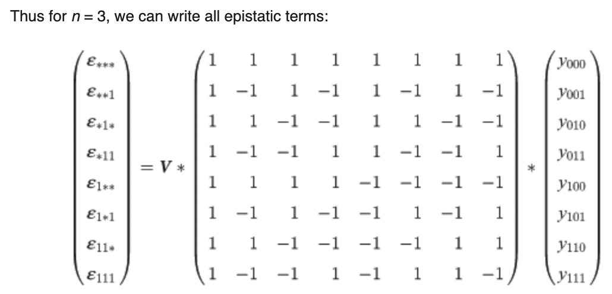
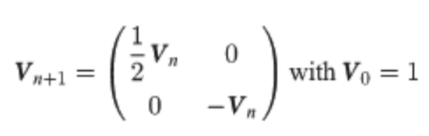
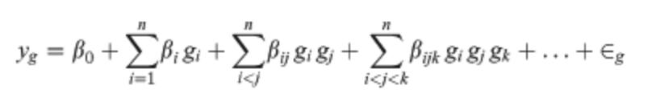
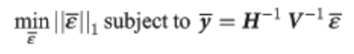

# [The Context-Dependence of Mutations: A Linkage of Formalisms](https://journals.plos.org/ploscompbiol/article?id=10.1371/journal.pcbi.1004771#pcbi.1004771.e021)
Frank J. Poelwijk, Vinod Krishna, Rama Ranganathan
PLOS CompBio 2016

c.f. [Hadamard transform - Wikipedia](https://en.wikipedia.org/wiki/Hadamard_transform)
c.f. [Fast Walsh–Hadamard transform - Wikipedia](https://en.wikipedia.org/wiki/Fast_Walsh%E2%80%93Hadamard_transform)

Poelwijk et al. connects three definitions of epistasis[^1] with the Walsh-Hadamard Transform (WHT). Generally, epistasis is the degree of non-independence (in an additive sense) between a set of $$k$$ positions, with respect to some function. The null hypothesis is that mutations are linear additive over WT, e.g., $$y_{1,1}=y_{0,1} + y_{1,0} - y_{0,0}$$. An epistatic term then tries to measure how much we deviate from this NH, e.g., $$\epsilon_{1,1} = y_{1,1} - (y_{0,1} + y_{1,0} - y_{0,0})$$ s.t. $$\epsilon_{1,1} = 0$$ if additive.
A key realization is that we can also view epistatic terms as a mutational path: $$\epsilon_{1,1} = (y_{1,1} - y_{0,1}) - (y_{1,0} - y_{0,0})$$ s.t. inside the parens we measure the effect of M0 and outside that of M1. This can then be thought of spectrally: we can array function values such that mutations occur at different frequencies in the 1-d array. This means we can use the binary WHT[^2], to do spectral analysis. From here, we see that the Hadamard matrix (and more generally, its recursion pattern) will pick out terms at each of the different mutational "frequencies" and provide appropriate signs to yield an epistatic term as a sum over function values[^3]. The Hadamard matrix flips only the bottom right sign because the first half of the epistatic terms it computes should be a sum (e.g., averaging over only M0), and the second half of the terms it computes are a difference (e.g., diff. when M1 introduced) corresponding to the new mutation being addressed @ this specific recursion level. As such, $$H_0$$ does nothing (identity), $$H_1$$ gives \[average regardless of M0, difference induced by M0\], $$H_2$$ gives the same for M1, but now using the terms computed already by $$H_1$$ (hence recursive building), and so on.
The scaling matrix $$V$$ must also be adapted to the epistasis definition. The WHT ordinarily scales by $$\frac{1}{\sqrt2}^{n}\cdot I_n$$ which keeps the transform unitary[^4] and also has an interpretation as preserving energy[^5] . Poelwijk et al. suggests instead scaling the first row by $$\frac{1}{2}$$, consistent with the average[^6], and the second by $$-1$$ because by default the WHT gives the difference $$y_{0,0} - y_{1,0}$$ but we'd like to know the improvement *over* WT.
A naive algorithm simply constructs $$H_n$$, pads $$y$$ to length $$2^n$$, and then does mat-vec mul in $$O(n^2)$$. Alternatively, one can skip constructing $$H$$ and use divide and conquer with $$H$$ embedded in the "conquer" ops; basically recursively subdividing function value vector in half and composing with other half (all addition, except bot right term). This can be done in $$O(n\:\text{log}(n))$$.
We can write all three types of epistasis as the WHT with extra matrix products; background-averaged epistasis corresponds to the default WHT.
^ddbd2a

Background avg --> $$\epsilon = V \cdot H$$

For ordinary WHT, $$V$$ is just a scalar and is simply $$\frac{1}{\sqrt2}^n$$ to keep the matrix orthonormal (unitary) which preserves norms meaning that the norm (and thus scale) of the epistatic coefficients computed will stay the same as the function values inputted.
Here, $$V$$ is defined differently to be consistent with epistasis formulas:

WT-relative --> $$\epsilon = V \cdot X^{T}\cdot H$$, where $$X^T$$ picks out terms relevant to the WT. In the above matmul, any $$*$$ term does not mean averaging over all possible identities $$\{0,1\}$$, but instead just $$\{0\}$$.

LR --> $$\epsilon = V \cdot (X^{T}\cdot S) \cdot H$$, $$S = QQ^T$$, the identity matrix w/ zeros on diagonal w/ order $$\gt r$$. Note that this can be written also with omission of $$X^T$$ and I believe this is what [Generalized Walsh-Hadamard Transform](dne.md) does, though this may bring about issues of having more coefficients than datapoints. ??

# Connections
## Sparse optimization approach

Mentions solving the following problem: 
How would this actually be done in practice?
» Notice that the L1 norm is actually a linear function of the optimization variable. Notice also that the equality constraint is linear (obviously). This means this whole thing is actually just an LP and can be solved as such, I believe.

# Relevance
See [Walsh-Hadamard Transform](dne.md).

# Footnotes

[^1]: 1) WT-background epistasis (only consider mutations in the context of WT, meaning positions outside of epistatic set are WT), which can be thought of as a Taylor expansion around WT. 2) Background-averaged epistasis (average over contexts, meaning positions outside of epistatic set take on all/any values), which corresponds to Fourier expansion (finds global patterns). 3) Linear regression view which largely adds a) compression (choose an epistatic order $$r < n$$) and b) accommodates not having the a complete vector of functional values up to order $$r$$.
[^2]: Which is the discrete analog of the Fourier transform
[^3]: This assumes and critically relies on the function values being entered in an order respecting these frequencies, namely, e.g., $$[y_{0,0,0}, y_{0,0,1}, y_{0,1,0}, y_{0,1,1}, y_{1,0,0}, y_{1,0,1}, y_{1,1,0}, y_{1,1,1}]^T$$. Notice how between entries (0,1), (2, 3), … the difference is M2. Notice how between entries (0, 2), (1, 3), … the difference is M1. Notice how between entries (0, 4), (1, 5), … the difference is M0. The ordering of mutations is not important, as long as this distance between mutants ($$2^0$$, $$2^1$$, $$2^2$$, …) structure holds.
[^4]: Meaning the norm of the input vector $$y$$ is preserved after the transform.
[^5]: That I've not tried to understand.
[^6]: We expect epistasis to be an average on the top term, see $$\epsilon_{*,*,*,…}$$. This provides also the average in other terms.
