#  [Generative Flows on Discrete State-Spaces: Enabling Multimodal Flows with Applications to Protein Co-Design](https://arxiv.org/abs/2402.04997)
Andrew Campbell, Jason Yim, Regina Barzilay, Tom Rainforth, Tommi Jaakkola

ICML 2024

#  Overview
Want multimodal (i.e., continuous AND discrete together) for co-generation (of structure AND sequence at same time). Define a probability flow (continuous), $p_t$, which linearly interpolates from noise to data. To sample $x_t$, simply simulate a sequence based on $p_t$ by using a denoising NN. Can adjust CTMC stochasticity level at inference time, as opposed to prior works.

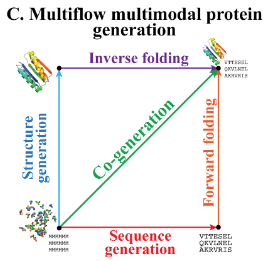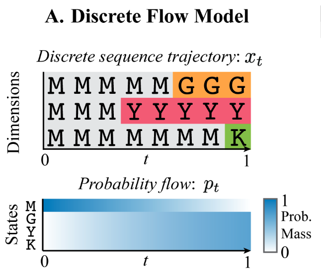

# <a name="-5-Min-overview-of-the-setup--->-key-idea"></a> 5 Min overview of the setup --> key idea
Diffusion works well for modeling continuous state spaces, but we’d like to extend this to discrete spaces so we can model sequences. In particular, we have good continuous-space generative models for e.g., structure. One thing we’d like to do is have a joint generative model over structure *and* sequence (develop through time together / aware of each other)[^1]. Currently, we have to do one or the other, and then conditional generation[^2].
Previous works on discrete diffusion are generally in discrete time[^3] as well. This paper generalizes these to increase flexibility at sampling time, which can then improve performance.

#  5 Min overview REVISED
We want to use flow modeling (b/c flexible for sampling and empirically has improved over diffusion) and we want to do co-generation of protein structure and sequence at the same time. Continuous state space flow models already exist.

The primary contributions of this paper is to introduce a discrete state-space flow model and then train it together with a continuous state space flow for protein co-generation.

The discrete flow model relies on two key technical contributions: rate matrix parameterization, view as CTMC and conditional flow matching loss which makes this tractable to train.

The rate matrix parameterization allows us to view a discrete stochastic process as a CTMC, where in discrete diffusion, we only had transition probabilities at each discrete timestep as the noising process. The rate matrix allows us to reason about transitions in continuous time, gives us $\partial_tp_t(x_t)$, and allows for more flexible sampling b/c probability of transitioning is $R_t \cdot dt$ and we can define different $dt$ (corr. different samplers) for different sampling properties.

The general idea of flow matching is to supervise a probability flow between $t=0$ and $t=1$. Of course, we only have samples for $t=1$ and we don’t know how to specify the intermediaries, so how can we supervise a model to this?
Conditional flow matching tells us that instead of modeling the noise process as $p_t(x_t)$, we can model it as an expectation over data-conditioned distributions $p_{t|1}(x_t|x_1)$. This is easier to specify: “I tell you where you’re going and you tell me how to get there (via linear interpolation)” (we can only think about linear interpolation b/c we have $x_1$ as conditioning information).
This lets us bridge between having samples from $p_\text{data}$ and wanting to learn $p_{1|t}(x_1|x_t)$; we can sample $x_t$ using conditional flow and then train on a reconstruction (CE) loss.

Once we have a discrete flow model, we simply add another head to an existing structure flow model that outputs AA logits, add a cross entropy term to the loss, and train by sampling independent timesteps so that you can do conditional inpainting.

They show that compared to earlier co-generation attempts, they get much more designable and diverse sequences.
On structure only generation task, does better than earlier co-generation attempts and RFdiffusion, whether you get to sample (inv-fold) more or fewer sequences. This is measured w/ self-consistency so not super surprising.

#  5 Min overview REVISED 2
We want to use flow modeling (b/c flexible for sampling and empirically has improved over diffusion) and we want to do co-generation of protein structure and sequence at the same time. Continuous state space flow models already exist.

The primary contributions of this paper is to introduce a discrete state-space flow model and then train it together with a continuous state space flow for protein co-generation.

The discrete flow model relies on two key technical contributions: rate matrix parameterization, view as CTMC and conditional flow matching loss which makes this tractable to train.

The rate matrix parameterization allows us to view a discrete stochastic process as a CTMC, where in discrete diffusion, we only had transition probabilities at each discrete timestep as the noising process. The rate matrix allows us to reason about transitions in continuous time, gives us $\partial_tp_t(x_t)$, and allows for more flexible sampling b/c probability of transitioning is $R_t \cdot dt$ and we can define different $dt$ (corr. different samplers) for different sampling properties.

The general idea of flow matching is to supervise a probability flow between $t=0$ and $t=1$. Of course, we only have samples for $t=1$ and we don’t know how to specify the intermediaries, so how can we supervise a model to this?
Conditional flow matching tells us that instead of modeling the noise process as $p_t(x_t)$, we can model it as an expectation over data-conditioned distributions $p_{t|1}(x_t|x_1)$. This is easier to specify: “I tell you where you’re going and you tell me how to get there (via linear interpolation)” (we can only think about linear interpolation b/c we have $x_1$ as conditioning information).
This lets us bridge between having samples from $p_\text{data}$ and wanting to learn $p_{1|t}(x_1|x_t)$; we can sample $x_t$ using conditional flow and then train on a reconstruction (CE) loss.

Once we have a discrete flow model, we simply add another head to an existing structure flow model that outputs AA logits, add a cross entropy term to the loss, and train by sampling independent timesteps so that you can do conditional inpainting.

They show that compared to earlier co-generation attempts, they get much more designable and diverse sequences.
On structure only generation task, does better than earlier co-generation attempts and RFdiffusion, whether you get to sample (inv-fold) more or fewer sequences. This is measured w/ self-consistency so not super surprising.

#  TODO
Think more about [Guidance-of-multimodal-model](#Guidance-of-multimodal-model).

~~scan invariant point attention~~

~~Difference btwn $Q, R$ ? — why does it matter? I think they use $R$ to be analogous to $u_t(x)$ vector field in [Flow Matching Notes](dne.md)? Wrong.~~
$R$ is used so that they can have a nice relation in the Kolmogorov equation, which is defined for rate matrices and not transition matrices.

Write normal ELBO too for discrete data

Work through 

Also work through 

A Continuous Time Framework for Discrete Denoising Models — SI for more on DB

scan “Formulating discrete probability flow through optimal transport”; also 

~~read briefly about SE(3) and SO(3); [Multiflow-setup](#Multiflow-setup)~~

~~Note that Fokker-Planck equation is the Kolmogorov forward equation.~~

#  Plausible questions
- Explain the experiments
- Write and explain Kolmogorov equation
- How does detailed balance relate to the Kolmogorov equation?
- Write form and explain rate matrix
- Why not just sample from $p_{1|t}$ if we’ve learned that?
	- B/c we have the intuition that making changes more gradually in a sequential generation process allows for more expressivity. We only want to simulate a small timestep forward, which is why we use this to compute an instantaneous unconditional rate matrix. Somewhat analogous to predicting the noise in diffusion
	- Rate matrix plays this role
- Relate rate matrix to transition probabilities
- What’s the sampling algorithm?
- What’s the training loss?
- What’s invariant point attention?
- What’s the architecture of the AR model they compare to?
- Explain D3PM baseline
- Why can’t we just use diffusion for this multimodal generation problem? Specifically combination aspect
- Why can’t we just use diffusion for discrete data modeling
- What object is parameterized?
- Why do we parameterize the probability flow instead of the rate matrix?
- Explain detailed balance.
- Explain and prove Prop. 3.2
- Explain and prove Prop 3.3
- What’s a good choice for the rate matrix? Justify / explain the intuition.
- Why do we want to be able to control the stochasticity during sampling?
- What does it mean to change the sampling temperature?
- In what way do we combine the different modes into a single flow?
- Could I make a multimodal (seq and struct) generative model using a discrete diffusion model and a continuous diffusion model? What might that look like, why would this not work or be preferable?
- Explain Fig. 2
- Explain Fig. 3
- Explain Table 3
- Derive the forms for uniform, mask noise process rate matrices.
- What are their results, what do they mean?
- What are the ways they evaluate their method?
- (why) is this better than having a single generative model and using a conditional regression model (e.g., AlphaFold or InvFold)?
- What are existing limitations of this approach?
- How might you improve this approach?
- How might you extend this approach?
- Can you diagram the model with all components and inputs / outputs?
- What’s the probability distribution we’re trying to model?
- What is an exponential rate scheduler? Why is it used for rotations? What is its form?
- What is purity sampling? Why used for AA sampling?
- How can previous discrete diffusion models be written in terms of DFM? (app H)
- What is SEDD?
- What are other possible choices for $R$? (“A Continuous Time Framework for Discrete Denoising Models”)
- Write the standard VAE ELBO derivation.
- Explain why the loss is just cross entropy.
- Write the Kolmogorov equation in vector form. Write it for a single state and explain it.
- Write the form of the conditional process.
- Write the form of the generative process.
- Write the form of generative sampling.
- Why don’t we parameterize $Q$ instead of $R$?
	- The Kolmogorov equations are defined for $R$, not $Q$, and easier to not convert back and forth.
	- The rate matrix can be easily converted to $Q$ by picking a (small enough) $dt$ and multiplying, and this allows us to very flexibly choose what period / resolution we want transition probabilities over. If we parameterized $Q$, we’d need an infinite sequence, and would have to take a derivative (e.g., finite elements) on $Q$ to get $R_t$, which may not have the expressivity we’d desire. Using $R$ allows us to easily use samplers of different resolutions (if $R$ is small, can have larger time steps), whereas for $Q$ we’d have to look at the change (i.e., the rate matrix) to determine how sampling is permitted. Sort of like parameterizing the derivative instead of the function, and in practice we don’t have to integrate to get the function back because we just use FD approximations.

##  From Perplexity
###  Conceptual Questions

1. What is the main contribution of Discrete Flow Models (DFMs) to the field of generative modeling?
2. How do DFMs differ from existing discrete diffusion models?
3. Why is the ability to handle both discrete and continuous data important in scientific applications?
4. What is the significance of CTMC stochasticity in DFMs?
5. How does the multimodal framework presented in the paper apply to protein co-design?
6. What advantages does Multiflow offer over previous approaches to protein generation?
7. Why is joint generation of protein structure and sequence potentially more beneficial than generating them separately?
8. How does the concept of probability flow relate to the generation of discrete data in DFMs?
9. What is the rationale behind using Continuous Time Markov Chains (CTMCs) in the development of DFMs?
10. How does the sampling flexibility of DFMs contribute to their potential advantages in multimodal problems?

###  Technical Questions

1. Explain the mathematical relationship between the generative flow pt and the conditional flow pt|1 in DFMs1.
2. Derive the Kolmogorov equation for a CTMC and explain its significance in the context of DFMs1.
3. How is the rate matrix Rt(xt, j) calculated in DFMs, and what is its role in the sampling process1?
4. Describe the training objective (Lce) for DFMs and explain how it differs from the ELBO used in diffusion models1.
5. Explain the process of simulating a sequence trajectory in DFMs using Euler steps1.
6. How does the masking approach in the conditional flow pmask
    t|1 work, and what are its advantages1?
7. Derive the expression for the conditional rate matrix Rt(xt, j|x1) for the masking-based conditional flow1.
8. Explain the mathematical relationship between continuous space linear interpolant flow models and DFMs with masking, as shown in Table 1 of the paper1.
9. How is the denoising distribution pθ 1|t(x1|xt) approximated and used in the sampling process of DFMs1?
10. Describe the mathematical formulation of CTMC stochasticity and how it affects the sampling process in DFMs1.

##  From chatGPT

###  **Conceptual Questions**

1. What is the primary motivation behind developing Discrete Flow Models (DFMs)?
2. How do DFMs address the limitations of discrete diffusion models such as D3PM?
3. Explain the concept of Continuous Time Markov Chains (CTMCs) and their role in DFMs.
4. Why is combining discrete and continuous data important in generative modeling, particularly for protein co-design?
5. How does Multiflow differ from prior approaches in protein co-design, such as RFDiffusion and ProteinGenerator?
6. What is CTMC stochasticity, and how does it influence sample trajectories?
7. How do DFMs achieve multimodal generative modeling? Discuss the integration of discrete and continuous flows.
8. What are the advantages of separating the structure and sequence noise levels (t and t̃) in Multiflow?
9. How does the paper address the trade-off between diversity and designability in protein generation?
10. Discuss the implications of using data distillation and synthetic data for improving Multiflow's performance.

###  **Technical Questions**

1. Derive the Kolmogorov equation for CTMCs and explain its significance in defining probability flows.
2. How does the proposed rate matrix Rt(xt,j∣x1)R_t(x_t, j|x_1)Rt​(xt​,j∣x1​) ensure that the conditional flow pt∣1(xt∣x1)p_{t|1}(x_t|x_1)pt∣1​(xt​∣x1​) is generated correctly?
3. What are the key steps in training a Discrete Flow Model, and how does the loss function relate to the Evidence Lower Bound (ELBO)?
4. How does the method handle the challenges of sampling from multimodal distributions during inference?
5. Describe the algorithm used for sampling from DFMs. What is the role of the rate matrix in this process?
6. How is the neural network pθp_\thetapθ​ trained to approximate the denoising distribution p1∣t(x1∣xt)p_{1|t}(x_1|x_t)p1∣t​(x1​∣xt​)?
7. What is the effect of parameter η\etaη in the rate matrix RtηR^\eta_tRtη​, and how is it optimized for CTMC stochasticity?
8. Explain the factorization of multimodal conditional flows used in Multiflow. How are continuous and discrete modalities integrated?
9. How does the paper validate the effectiveness of DFMs using text modeling experiments? What metrics are used for evaluation?
10. What modifications were made to the FrameFlow architecture to support amino acid prediction in Multiflow?

#  Intro, background (p 1-3)
##  Motivations
Diffusion models are a good starting point for co-generation in that we can define them on both continuous and discrete state spaces (more on this in [Previous-work-on-discrete-flows/diffusion-in-discrete-time](#Previous-work-on-discrete-flows/diffusion-in-discrete-time)).
Sampling flexibility is bad on diffusion models in general, hard to find optimal parameters and generally have to retrain b/c the time discretization @ training is tied to the discretization you can use @ sampling. This is hard for single modalities, so we might expect it to be even more complex for multiple modalities. Don’t want to do this if possible.
However, we also have flow-based models as a sort of analog / alternative to diffusion. These increase sampling flexibility and so can generally improve over diffusion, and are also a simpler framework. However, there aren’t previous works defining flow-based models on discrete spaces. I think what happens here is they combine the idea from argmax flows (having an underlying continuous-space flow that gets converted to discrete trajectory somehow; however, this is in discrete time and the conversion is literal argmax operation) with flow-based modeling in continuous time of discrete probability mass functions (which discreteness makes them finite-dimensional vectors that are still continuous-valued).
The goals are
1) allow for sampling flexibility sans retraining
2) allow simple combination w/ continuous-space flows —> multimodal

##  Previous work on discrete flows/diffusion in discrete time
](dne.md)
](dne.md)

##  Previous work on continuous time diffusion / flow modeling

](dne.md)

##  CTMC setup

#  Discrete Flow Models (p 3-?)
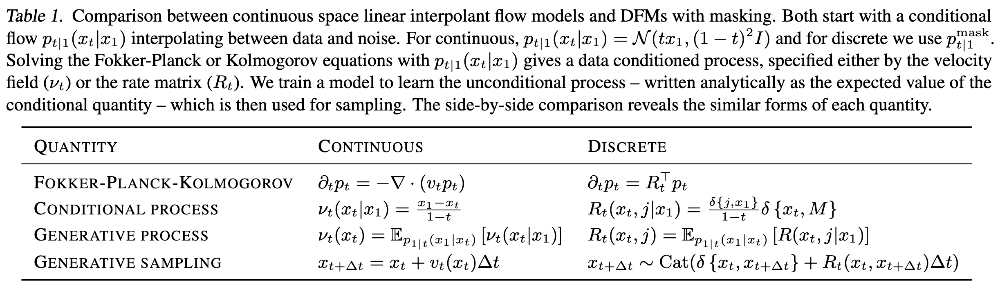
Map from [Flow Matching Notes](dne.md) to DFM (present).

Procedure: 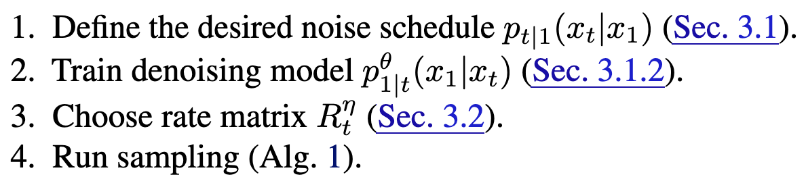

##  DFM Definition

**Key idea:** parameterize a continuous-time *probability flow* (a la [CTMC Notes](dne.md); [Flow Matching Notes](dne.md)); this flow will operate on probability mass vectors (also continuous-valued) that represent transition probabilities for a discrete data distribution. In this way, we can have a discrete data generative model that’s parameterized with all continuous underlying probabilities and flows[^4].

Define conditional flow, as in [Flow Matching Notes](dne.md):
$$
p_t(x_t) = \mathbb{E}_{x_1 \sim p_\text{data}(x_1)}[p_{t|1}(x_t|x_1)]
$$

Then, we can easily pair (how?) this with a continuous space flow model, meaning you can now generate both structure and sequence together.
→ **How:** (guess) have a single NN model that outputs both the rate matrix $R_t$ that generates the flow for the discrete space probability distribution and the vector field $u_t$ that generates the flow for the continuous space distribution.
» No, rate matrix will actually be chosen ([Choice-of-rate-matrix](#Choice-of-rate-matrix)). We will parameterize the conditional flow $p_{1|t}(x_1|x_t)$ instead. MORE INFO…

###  Previous confusion, cleared up / no longer relevant
I still really don't understand why we need both the rate matrix and the probability flow. If they're defined in terms of each other, isn't only one sufficient? Practically, are there two different things being learned, or is it just one of them and the other is always calculated from the other (even if in expectation)?
→ see [Flow Matching Notes](dne.md).

##  DFM Implementation details
###  How do we define $p_{t|1}$ (“noising process” analog)?

Multiple choices. Two examples.
- Common properties:
	- linearly interpolate btwn $x_1$ and chosen prior
	- probability mass on $x_t=x_1$ scales linearly w/ $t$; converges on datapoint at $t=1$
- Uniform prior, $p_{t|1}(x_t|x_1)=\text{Cat}(t\delta\{x_1,x_t\}+\frac{(1-t)}{s})$[^5]
	- other states always have same (increasing w/ $t\rightarrow0$) probability mass
	- uniform at $t=0$: $p_{0|1}(x_0|x_1)=\text{Cat}(\frac{1}{s})$
- Mask (absorbing state) prior, $p_{t|1}(x_t|x_1)=\text{Cat}(t\delta\{x_1,x_t\}+(1-t)\delta\{M,x_t\})$
	- MASK state has probability mass that increases linearly w/ $t\rightarrow 0$
	- other states all have 0 probability mass$p_{0|1}(x_0|x_1)=\text{Cat}(\delta\{M,x_0\})$ (only probability mass on MASK tokens)
where $\delta(a,b)$ returns $a == b$.

Generally, MASK is used / preferred in this paper.

###  DFM Sampling

From [CTMC Notes#Kolmogorov equation](dne.md), to define $p_t(x_t)$ we need $R_t(x_t, j)$.
Once we have $R_t(x_t, j)$, we can simulate time forward to sample from the data distribution using Eq. 3:
$$
x_{t+\Delta t} \sim \text{Cat}(\delta\{x_t,x_{t+\Delta t}\} + R_t(x_t, x_{t+\Delta t})\cdot \Delta t)
$$
Using insights from [Flow Matching Notes#Conditional flow matching](dne.md), we can define the rate matrix as datapoint-conditional:
$$
R_t(x_t, j) := \mathbb{E}_{p_{1|t}(x_1|x_t)}[R_t(x_t, j \;|\;x_1)]
$$
Note that expectation is over $p_{1|t}(x_1|x_t)$, which predicts clean data from noisy data and will be parameterized via NN (see [Training](#Training)). By Bayes’ rule, $p_{1|t}(x_1|x_t) = \frac{p_{t|1}(x_t|x_1)p_\text{data}(x_1)}{p_t(x_t)}$.
The datapoint-conditional rate matrix will be *chosen*; see [Choice-of-rate-matrix](#Choice-of-rate-matrix).

Given these components, we then run from $t=0$ to $t=1$ (using fixed step size $\Delta t$), estimating the unconditional rate matrix by sampling from $p_{1|t}$ and then simulating time forward with the rate matrix.
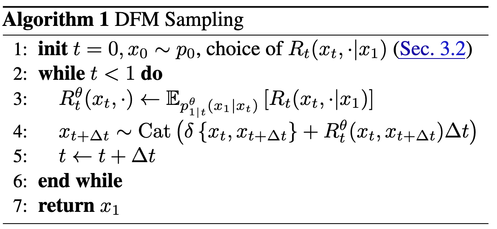

See also Appendix G.

###  DFM Training

Parameterize $p_{1|t}^\theta (x_t|x_1)$ w/ NN. Use cross-entropy[^6] loss of correctly reconstructing $x_1$ from $x_0$:
$$
\mathcal{L}_\text{ce} = \mathbb{E}_{p_\text{data}(x_1),\; \mathcal{U}(t;0,1),\; p_{t|1}(x_t|x_1)}[\log \;p_{1|t}^\theta(x_1 \;|\;x_t)]
$$
Notice that $p_{t|1}$ is simply noising process and doesn’t require simulation or anything of the sort; see [How-do-we-define-$p_{t-1}$-(“noising-process”-analog)?](#How-do-we-define-$p_{t-1}$-(“noising-process”-analog)?). Notice also that the loss **does not depend on $R_t$** at all, so choice can be deferred until after training and flexibly interchanged depending on sampling whims.

See Appendix C for relation btwn $L_\text{ce}$ and ELBO — how come there’s no KLD term?   
Here, $x_t$ is the latent variable in the regular ELBO written as $z$. One way to write it normally is as the reconstruction term on $p(x|z)$ minus a KL term $\text{KL}(q(z|x) \;|| \;p(z))$ keeping the encoder close to the prior. However, here there’s no learned encoder — this is a defined noise process $p_{t|1}$ and so the KL term is constant / satisfied already.

###  Choice of rate matrix

Need to define a conditional rate matrix $R_t(x_t, j|x_1)$ to generate the conditional flow $p_{t|1}(x_t|x_1)$. Note that there are many valid choices of $R_t$, which can be built from the base described below, which are elaborated on in [Detailed-balance](#Detailed-balance). At inference time, choose the rate matrix that performs best b/c can change them out for free.

####  Basic rate matrix:

Notice that we need not define the rate matrix for the $x_t=j$ case because this is just the negative sum of all the other entries in the row[^7]. Define for $x_t \neq j$:
$$
R_t^*(x_t,j|x_1) := \frac{\text{ReLU}(\partial_tp_{t|1}(j|x_1) \; - \; \partial_tp_{t|1}(x_t|x_1))}{S\cdot p_{t|1}(x_t|x_1)}
$$
w/ $S$ the number of states. Assumes $p_{t|1}(x_t|x_1) \gt 0 \; \forall \; x_t$. $\partial_tp_{t|1}$ can be obtained by differentiating the explicit form for $p_{t|1}$ in [How-do-we-define-$p_{t-1}$-(“noising-process”-analog)?](#How-do-we-define-$p_{t-1}$-(“noising-process”-analog)?)

Interpretation: if $\partial_tp_{t|1}(j|x_1) \; \gt \; \partial_tp_{t|1}(x_t|x_1)$ then state $j$ should gain more probability mass than the current state ($x_t$), so rate is positive. Otherwise, no reallocation of probability mass from $x_t$ to $j$. Normalized by probability mass of current state $x_t$. Using ReLU ensures that off-diagonal elements of $R_t$ are positive[^8].

How do we know that $R_t^*$ generates $p_{t|1}(x_t|x_1)$? We can plug $R_t^*$ into the [CTMC Notes#Kolmogorov equation](dne.md). Relies on assuming that any states with zero probability mass also have time-derivative of 0 (cannot recover from 0 mass state)[^9].   
We can substitute in the forms for noising processes to get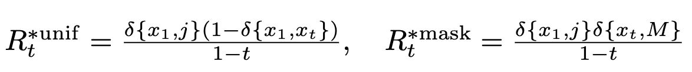   
####  Detailed balance

To generate other valid rate matrices from $R_t^*$:
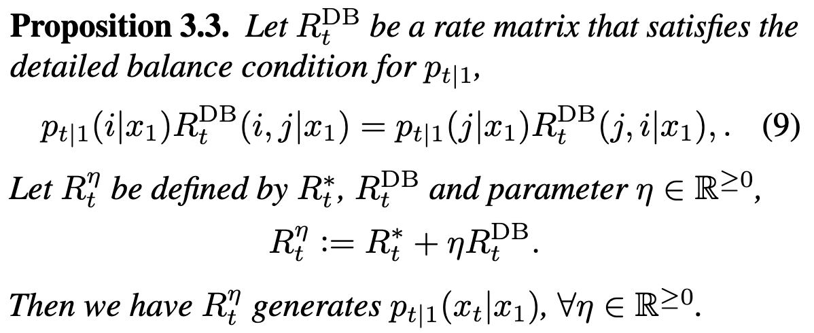

Interpretation: at time $t$, between states $i,\;j$, incoming probability mass to state $j$ must equal outgoing probability mass from state $i$. Basically, flow must be preserved by $R^\text{DB}$. If flow is preserved then can trivially add on any (positive) scaled version of $R^\text{DB}$ to $R^*$.

See Appendix F for solving for $R^\text{DB}$. Is there generally a singular $R^\text{DB}$?   
In previous works, e.g. “A Continuous Time Framework for Discrete Denoising Models”, DB used to make post-hoc inference adjustments. **What does this mean?**   
I think detailed balance is relevant for guaranteeing that $p_{t|1}$ is actually the stationary distribution; i.e., that $R$ will still generate it. The way to see this is by plugging this equation into the Kolmogorov equation for $p_{t|1}$, and using that the rowsum of $R$ is 0.
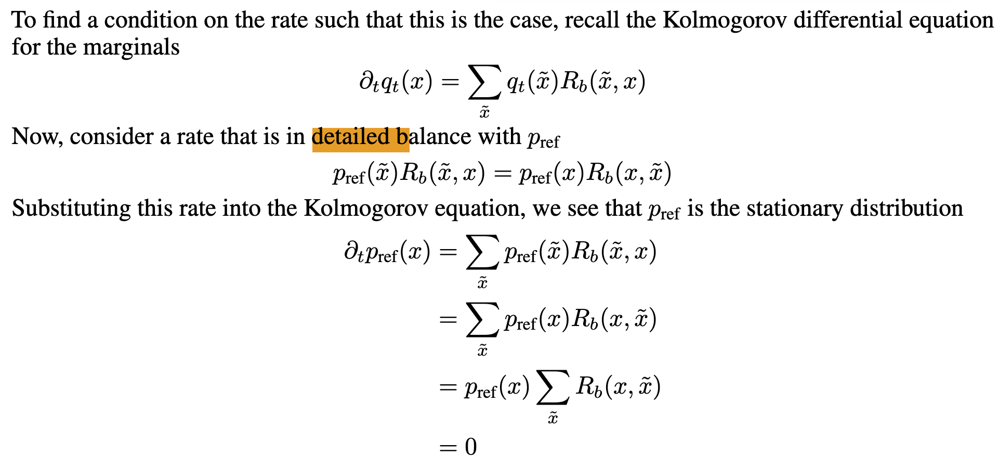

This implies also that we can just scale $R$ however we’d like (pos scaling).

DB tells us generally what we’re allowed to do when defining a rate matrix.
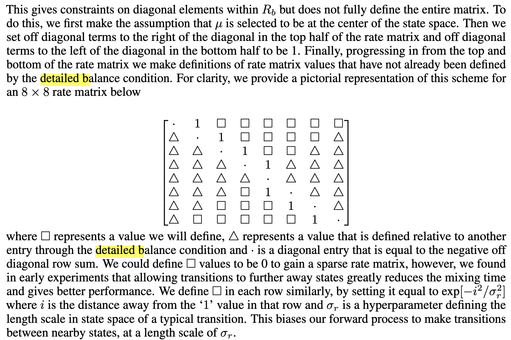
Note that for proteins, we won’t want to have the distance here naively, since AA states that are adjacent are not necessarily meaningfully closer. One could use BLOSUM or something w/ probabilities of substitution or “similarities” on AAs.

Still don’t fully understand how they’re getting squares vs. triangles, and how DB implies what elements have to be.
Each row represents probability of transitioning from that diagonal element to an other element.
If I define (0 to 1) in top row as 1, then (1 to 0) in second row is defined implicitly. I think this expands to say that given the upper triangle of the matrix, you get the bottom triangle implied. But then why do they define it in this half half way? **??**
Is it the naive statement that given $p_\text{ref}$,

We could have global balance, which sums over one of the variables:
$$
p(\tilde{x}) = \sum_{x} p(x) \cdot R(x, \tilde{x})
$$
Detailed balance is a stronger condition and implies global balance:
$$
p(\tilde{x}) \cdot R(\tilde{x}, x) = p(x) \cdot R(x, \tilde{x})
$$
We can see that global balance is implied because if we sum both sides over $x$, we get that equation (over all states, $R(\tilde{x}, x)$ sums to 1).
Importantly, **a CTMC is reversible iff DB is satisfied for every pair of states at every time step**. DB is exactly capturing reversibility — there’s no net flux between states $i$ and $j$ for over a timestep; if we reverse the process, it looks the same.

In this work, DB is mainly to increase inference time flexibility, since it allows a set of rate matrices to be used instead of just one, and specifies what set of rate matrices is allowed. These rate matrices have to have the same stationary distribution, but can be larger or smaller absolutely such that more transitions happen or fewer.

####  What are other reasonable choices of rate matrix?

From “A Continuous Time Framework for Discrete Denoising Models” SI:
1) Uniform rate matrix
2) absorbing state process rate matrix
These just sound like the noising processes… in fact, they are. how do they differ from the formulations above in [Basic-rate-matrix](#Basic-rate-matrix)?

####  CTMC stochasticity

Large $\eta$ —> large exchanges of probability mass between states —> more frequent jumps —> short auto-correlation time; high unpredictability of future states from current states.

Smaller $\eta$ may be more efficient — fewer jumps, avoiding needless exchanges of mass that will be reversed/undone later anyway[^10]. See Appendix E; unsure why statement made about assumptions is relevant.   
Expect that there’s some optimal stochasticity level[^11], but we don’t know how to set. Probably just use empirics.

#  Multimodal protein generative model (structure + sequence)

##  Multiflow setup

Will use Frameflow, which acts on backbone atomic coordinates of each residue[^12]. Residues are represented in SE(3). Let a protein of length $D$ be represented as $\{T_d\}_{d=1}^D$ where $T_d = (x^d,\;r^d,\; a^d)$. $x \in \mathbb{R}^3$ is translation of residue’s $\alpha$-carbon (from origin in global frame?), $r \in \text{SO}(e)$ is a rotation matrix of the residue local frame w.r.t. global ref. frame, $a \in \{1,…,20, M\}$ is AA sequence + MASK token.

Define $p_{t|1}(T_t|T_1)$ to factorize over dimensions and modality:
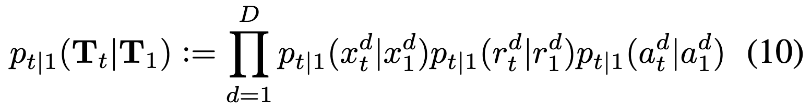

We then need to define the noising process for $x$ and $r$; we follow FrameFlow:
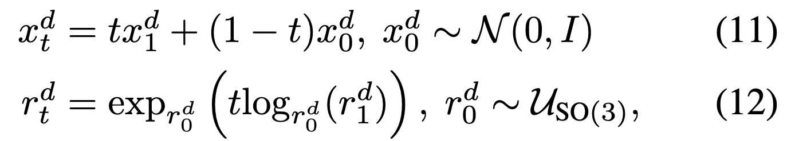
Note that the distributions $p_{t|1}$ for $x$ and $r$ are defined implicitly (similar to Gaussian diffusion), whereas for $a$, defined explicitly to be masking distribution described in [How-do-we-define-$p_{t-1}$-(“noising-process”-analog)?](#How-do-we-define-$p_{t-1}$-(“noising-process”-analog)?).

We’ll have an ODE on continuous modalities and CTMC for AAs. In particular, we define vector fields (“conditional velocities”) $v_x^d(x_t^d|x_1^d)$ and $v_r^d(r_t^d|v_1^d)$ (in R3 and Tan[^13] SO3[^14]??) which parameterize the corresponding conditional ODE. We can simulate the trajectory along each modality separately w/ Euler steps:
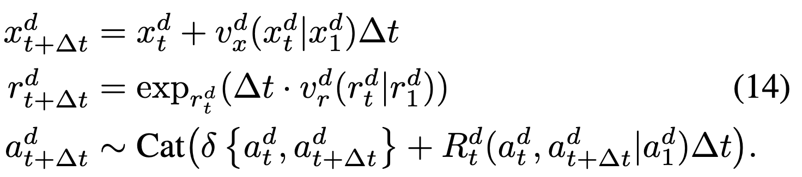
and these vector fields are defined according to FrameFlow:
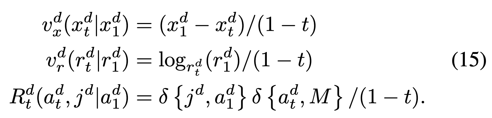
*review prop. that these have desired flow*

We can get unconditional velocities the same way we get unconditional rate matrix; by marginalizing (taking expectation w.r.t. $p_{1|t}(\cdot \;|\;T_t$)); note that despite factorization the flow has dependence on different modalities b/c conditioned on whole $T_t$.

We can also use different noise levels for the structure and for the sequence, which will enable flexible sampling (not always tied together). These noise levels will be sampled independently during [Multiflow-training](#Multiflow-training).

##  Multiflow training

Network takes as input noised protein $T_t$ and predicts denoised translations $\hat{x}_1$, rotations $\hat{r}_1$, amino acid distribution $p_\theta$. (is this all one network?) We can then parameterize unconditional velocities and rate matrix in terms of these (these are different from eq 15, 16, revisit to understand).

Minimize loss
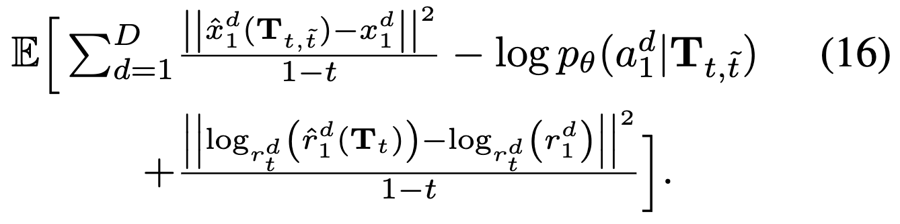
which is basically denoising MSE + DFM cross-entropy.

They find that designability is lower than PMPNN, and actually PMPNN produces more designable sequences than PDB. To make the comparison more fair, they “distill” PMPNN into the model by replacing each sequence in training dataset with the best fit[^15] of 8 sequences generated by PMPNN from the paired structure

##  Multiflow implementation details

Modified from Frameflow NN architecture: larger transformer, smaller IPA, extra MLP head to predict AA logits. So yes, all same NN w/ different heads.
$$
\hat{f}: T_t^d \mapsto [\hat{x}_1^d \;|\;\hat{r}_1^d \;|\;p_\theta(a_1^d)]
$$

##  Multiflow sampling

Take learned **un**conditional rate matrices, velocities. Plug into simulating equations below:
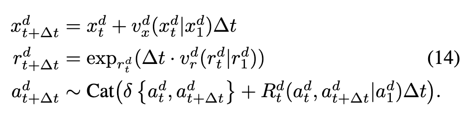

Note use of exponential rate schedule for rotations (I believe following FrameFlow).

###  Purity sampling

Also used purity sampling to decide which indices of AAs to unmask at each step.

Purity sampling is used in discrete diffusion literature to decide order to unmask tokens in the reverse process. This is because the probability of unmasking any token is constant at a given timestep. This stems from the fact that in the forward noising process, the probability of going to mask is also generally constant at a given timestep (increases as time goes on). However, we have intuition that some positions will have higher confidence on what they should unmask to, and it would be better to do these first. We define purity, and then importance sample w.r.t. it. Empirically, purity correlates well w/ accuracy at various time steps during diffusion (Fig. 1 of “Improved Vector Quantized Diffusion Models”).
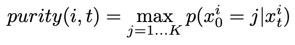

###  Conditional inpainting

Because the timestep is untethered between structure and sequence, can simply set structure or sequence and $t=1$ for that model and then sample the other.

#  Related work

##  Discrete diffusion

This work generalizes them, you can write others as DFM (see Appendix H).

Benefit is that noising processes are more general b/c you can write down $p_{t|1}$ directly. In discrete diffusion, noising process has to be written as a matrix exponential (meaning apply some matrix $T$ times). **??**

We can also choose the rate matrix at inference time, instead of being stuck reversing (discrete) time.

##  Protein design

Class of works like RFDiffusion that only do structure or only do sequence, and have to rely on AlphaFold / inverse folding to get the other afterward.

Other co-generation attempts:
1) (proteingenerator) diffusion over amino acids (in OHE space) and at each step predict structure w/ RF —> condition on
2) protpardelle diffuses over structure and at each step predicts sequence
3) some existing co-design methods but only for CDR region of antibodies / one doesn’t report standard metrics or code (I think it has two separate diffusion processes; the sequence one gets conditioned on structure)

#  Experiments

Don’t really show concrete results for how sampling flexibility for sequence and structure buys anything.
Shows one result which is that changing stochasticity ($\eta$) for sequence changes the alpha/beta sheets (secondary structure), which does demonstrate some seq/struct interaction.

#  Connections
##  Guidance of multimodal model
How would you do guidance properly if you have a flow for both structure and sequence? Following intuition that sequence generates function, but structure is an intermediary.
Further in [Multimodal guidance](dne.md).
See also 

#  Misc.

#  Footnotes

[^1]: One failure mode for a sequence generative model is generating a sequence that won’t fold or be stable; this information may be much more easily learnable / accessible through a structure generation model. And a structure generated may not be fully compatible with the fact that it must then be converted into AA sequence. Or maybe we want to be able to condition / control generation through the sequence or the structure or both, and this would be difficult if only generating in the space of one or the other — either can’t do it, constrain during conditional generation stage (may be too late), etc.
[^2]: Note also that we generally want to guide / condition toward some *function*, which for proteins we know is determined by the sequence but mediated by the structure. Therefore, having both information together should lend itself to more effective guidance.
[^3]: In which case you generally get locked into sampling along the same time discretization scheme that you originally trained with. Unsure if there are extensions that remedy this.
[^4]: This kind of idea, so far, seems essentially the same as [D3PM Notes](dne.md) in that there's some underlying continuous (time-varying) diffusion process (though in that case, it's still discrete time) which represents probabilities of discrete transitions and so is tethered to a discrete diffusion process as well. I guess they're arguing here that by using the continuous-time variant, they'll get more control + get to use flows and such.
[^5]: Think of this as defining a probability mass vector.
[^6]: b/c state space is discrete
[^7]: It’s effectively an extra degree of freedom that gets fixed; see [Gauges](dne.md) for somewhat relevant discussion.
[^8]: See “Formulating Discrete Probability Flow Through Optimal Transport”
[^9]: Seems like practically then, may need to not allow any of the probabilities to go to 0 (unless truly no chance of going there ever again in trajectory).
[^10]: Cites again “Formulating discrete probability flow through optimal transport”
[^11]: Simply b/c it’s a lever and so there must be some maximum? What makes us think this is an effective control lever? Intuition, …
[^12]: notably, not including side-chains.
[^13]: Can think of SO3 as a sphere, and then tangent space is like a tangent plane to a point on the sphere; a linear approximation at a point. SO3 is a curved manifold and can’t naively add rotation matrices (operations don’t commute). Tan SO3 is a linear space, and is amenable to addition. While SO3 is the rotations themselves as points, Tan SO3 has velocities (rates of rotation) as points. To map from SO3 to its tangent space we use logarithm map and to get back we use exponential map. All of this is desirable for optimization b/c we’d rather do it in a linear space. In the context of OT-style linear interpolation, it’s also much easier to do in Tan SO3; simply scale by $t$.
[^14]: SO3: group of all possible rotations around the origin. Has 3 DoF. SE3: group of all possible rotations AND translations from the origin. Has 6 DoF.
[^15]: scRMSD, side-chain RMSD, metric given for each generated sequence, representing how consistent that sequence is with the structure. This is done by computing a structure for each generated sequence (by RF or AF) and then taking RMSD w/ the provided structure
